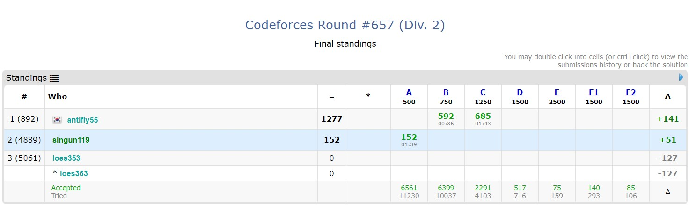
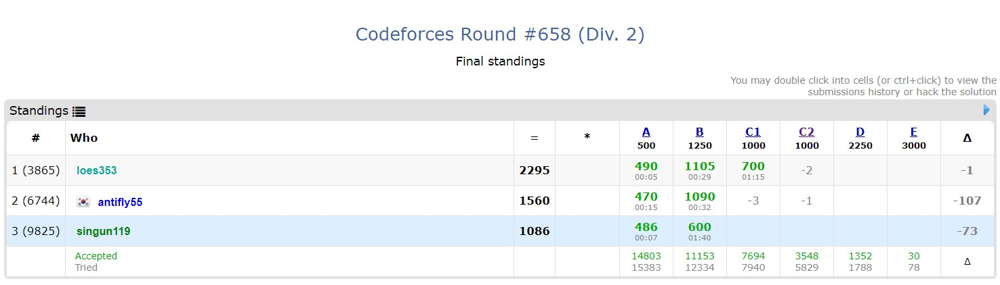

# algorithm-study

## 2020
### 07-19
[Codeforces Round #657 (Div. 2)](https://codeforces.com/contest/1379)

- [Acacius and String](https://codeforces.com/contest/1379/problem/A)
    - 문자열
    - 그리디
- [Dubious Cyrpto](https://codeforces.com/contest/1379/problem/B)
    - 수학
    - 부등식
- [Choosing flowers](https://codeforces.com/contest/1379/problem/C)
    - 그리디
    - lower_bound

### 07-20
BOJ
[골드를 풀자!](https://www.acmicpc.net/group/workbook/view/8373/24696)
| id | title | algorithm|
|-|-|-|
| 2142 | [정돈된 배열](https://www.acmicpc.net/problem/2142) | math |
| 2374 | [같은 수로 만들기](https://www.acmicpc.net/problem/2374) | math, dfs |
| 2836 | [수상 택시](https://www.acmicpc.net/problem/2836) | sweeping |

### 07-21
[Codeforces Round #658 (Div. 2)](https://codeforces.com/contest/1379)

- [Common Subsequence](https://codeforces.com/contest/1382/problem/A)
    - 단순 구현
- [Sequential Nim](https://codeforces.com/contest/1382/problem/B)
    - 수학
    - 그리디
    - 게임 이론
- [Prefix Flip (Easy Version)](https://codeforces.com/contest/1382/problem/C1)
    - string
    - dfs
    - greedy